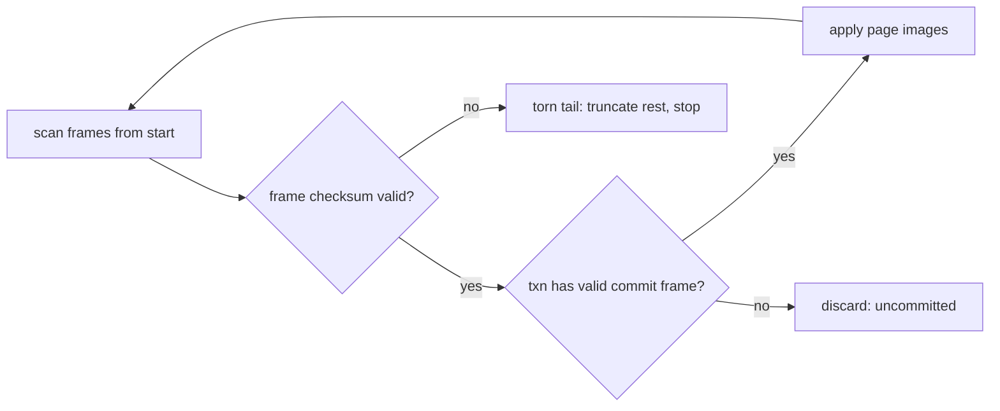
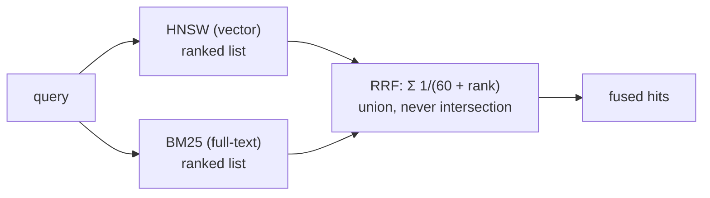

# Inside EmbedMind: a crash-safe memory file for AI agents

> **STATUS: DRAFT — [MANUAL — founder].** This is the prepared input for task B6
> (2nd technical post, "the engine from the inside"). It has **not** been reviewed or
> published. Every number below is frozen from
> [`benches/results/latest.md`](../../benches/results/latest.md) (0.1.0-dev,
> 2026-07-09, founder's Windows box, CPU-only, single-thread) — if the engine changes
> before publication, re-run `benches/run_all.sh` and refresh the tables. A number
> provenance appendix at the end maps every figure to its source. Publication venue,
> title, and final cuts are founder decisions.

---

My last post was the pitch: [EmbedMind](../../README.md) <!-- FOUNDER: swap for the
public repo URL at publish time --> gives coding agents
persistent memory — `remember`, `recall`, `forget` over MCP — stored in a single local
`.mind` file, no server, no API key. This post is the part I actually enjoy: how the
engine works. Three pieces, three sets of trade-offs:

1. a **physical page WAL** and the recovery that makes "kill -9 mid-write" boring,
2. an **HNSW index that lives in file pages** and addresses them directly — the reason
   an 819.8 MiB file opens in 0.33 ms,
3. **hybrid recall** that fuses vector and keyword lists with RRF instead of tuned
   weights.

All of it is Rust, `#![forbid(unsafe_code)]` in the engine, zero network dependencies.
Numbers are real and reproducible (`benches/` in the repo); where a competitor beats
us, that's in the tables too.

## The substrate: a paged file

A `.mind` file is an array of 4 KiB pages, little-endian, every page carrying an xxh3
checksum. Page 0 is the header; everything else — record B-tree, HNSW nodes, vector
blocks, full-text index, freelist — is just typed pages:

```
┌──────────────────────────────────────────────┐
│ Page 0 — header                              │
│  magic "MINDFMT1" · format_version           │
│  page_size · root pointers (btree, hnsw,     │
│  fts, graph) · embedding model id + dims     │
│  reserved: encryption flag + salt/KDF        │
├──────────────────────────────────────────────┤
│ BTREE pages     — memory records             │
│ HNSW pages      — index graph (one node/page)│
│ VECTOR pages    — embeddings, fixed stride   │
│ FTS pages       — inverted index + postings  │
│ FREELIST pages                               │
└──────────────────────────────────────────────┘
```

Two consequences worth calling out:

- **Checksums per page, not per file.** Silent corruption is detected at read time,
  page-granular. For a product whose brand is "your agent's memory never corrupts",
  detection is table stakes.
- **Additive evolution.** New features arrive as new page types plus a root pointer
  carved out of reserved header bytes. The full-text index bumped `format_version`
  1 → 2 and the graph layer 2 → 3, and **v1 files still open** — they just degrade
  (more on that in the RRF section). Encryption is reserved in the header since day 1
  so it can arrive later without a format break.

## Part 1 — Durability: a physical page WAL

The non-negotiable requirement: no confirmed memory is ever lost, and the file is
never unrecoverable, even on power loss mid-write. The design question is *what goes
in the log*.

We chose a **physical page-level redo log** (SQLite-style), not a logical operation
log. Every transaction appends the *images of the pages it modified* to a sidecar
`memory.mind-wal`:

```
.mind-wal layout:

┌────────────────────────────────────────────────────┐
│ WAL header: magic "MINDWAL1" · version · page_size │
│             salt (random per WAL generation)       │
├────────────────────────────────────────────────────┤
│ frame: [page_no · txn_id · commit=0 · checksum]    │
│        [ 4 KiB page image                     ]    │
│ frame: [page_no · txn_id · commit=0 · checksum]    │
│        [ 4 KiB page image                     ]    │
│ frame: [page_no · txn_id · commit=1 · checksum] ◄─ │ commit record
│        [ 4 KiB page image                     ]    │
│ ...                                                │
└────────────────────────────────────────────────────┘
```

The commit protocol is three steps: append all frames of the transaction → `fsync`
the WAL → the last frame carries `commit = 1` and a checksum seeded with the WAL's
random salt. **A transaction is durable iff its commit frame is fully valid on
disk.** The salt kills a classic failure mode: stale frames from a previous WAL
generation can never replay as valid.

Recovery, on *every* open, is correspondingly dumb — and dumb is the point:



Replaying a physical WAL is `memcpy` plus checksum checks. A *logical* log would be
more compact, but replay would re-execute domain logic — insert into the B-tree,
touch the HNSW — multiplying the possible post-crash states. Physical redo has
essentially one behavior to verify, so we can verify it brutally:

- a **fault-injecting VFS** kills the simulated process before/after every mutating
  I/O, with sector-granular torn writes and a lying-fsync mode; the crash harness
  sweeps every kill point over real workloads and checks invariants against a
  reference model (every committed transaction present, no half-transaction, all
  checksums valid);
- the **WAL replay path is a fuzz target** (`fuzz_wal_replay`), along with the
  header, page, and record parsers — short pass on every PR, 1h/target nightly.

When the WAL reaches 4 MB (or on clean close), a checkpoint copies committed pages
into the main file, fsyncs it, and truncates the WAL — so a cleanly closed database
is truly a single file. On Windows, "fsync" means `FlushFileBuffers`, and the same
torn-write harness runs there in CI — I develop on Windows precisely because nobody
else tests durability there.

One number to anchor this: `remember` — embed the text, write record + vector +
index pages, commit, fsync — is **7.37 ms p50 / 22.43 ms p99 end-to-end at 100k
memories**. Full fsync-per-commit durability is the default and the only mode in
v0.1; the p99 has an order of magnitude of headroom against the 200 ms budget.

## Part 2 — An HNSW that lives in pages, addressed directly

For vector search we implemented HNSW ourselves instead of using `hnsw_rs` or
`usearch`. Not for fun: every off-the-shelf option assumes the whole graph in RAM
with monolithic serialization — load everything, use, save everything. That breaks
the two promises that define the product:

- **instant open**: `Store::open` on the 100k / **819.8 MiB** file takes
  **0.33 ms**, because opening reads the header and the fixed-size HNSW meta page —
  never the graph. The first query on that cold store completes in **12.89 ms**,
  paging in only the nodes the search actually visits;
- **transactional index**: HNSW mutations are ordinary page writes, so they ride the
  same WAL as the record. After a crash, index and data cannot disagree — there is
  no separate index journal, no "rebuilding index..." on startup, ever.

### Direct page addressing (the ADR 0008 story)

The first draft of the on-disk layout did the obvious thing: give each node a
logical `node_id: u32` and keep a `node_id → page` table in the index's meta page.
Implementation reality disagreed twice: the table capped out at ~405 nodes per 4 KiB
page, and — worse — it was rewritten *whole* on every insert. Write cost grew O(n)
with index size. Chaining table pages removes the cap but not the O(n).

Any table-shaped fix (chained pages, two-level directory, a secondary B-tree)
keeps a structure that grows with the index, needs its own I/O, and is one more
thing to corrupt, fuzz, and recover. So we deleted the concept:

```
  with a location table            direct addressing (shipped)

  neighbor: node_id 42             neighbor: page 1337
      │                                │
      ▼                                ▼
  meta table: 42 → page 1337       read page 1337
      │
      ▼
  read page 1337
```

**The node's identifier *is* its physical page number.** Adjacency lists store
`page_no: u64` of neighbor pages; the entry point in the meta page is
`entry_point_page`. It's the same move that makes disk-resident ANN graphs work
(DiskANN and family). What falls out:

- **Insert touches O(M) pages** — the new node, its rewired neighbors, the vector
  block, the meta — *regardless of index size*. No table rewrite, no cap on node
  count (u64).
- **One search hop = one page read.** One less indirection than any table design.
  Each node page also carries a copy of its vector's location, so a candidate is
  scored with one page read, not a B-tree lookup per hop.
- **The meta page is fixed-size forever** — parameters (`M=16`,
  `ef_construction=200`), `max_layer`, `entry_point_page`, `node_count`. Nothing to
  chain, nothing to grow, nothing extra to recover.
- The cost: neighbor references are 8 bytes instead of 4, and any operation that
  relocates node pages must rebuild the index — which `vacuum` does anyway, by
  design (deletes are tombstones; HNSW has no cheap online removal).

A node page looks like this (one node per page; a node's level is clamped so a full
node always fits — encoding a node the engine built can't fail):

```
HNSW_NODE page:
┌──────────────────────────────────────────────┐
│ record_id (ULID) · vec location (page, slot) │
│ layer_count                                  │
│ layer 2: [count][page_no, page_no, ...]      │
│ layer 1: [count][page_no, ...]               │
│ layer 0: [count][page_no, ...]  (≤ 2M here)  │
└──────────────────────────────────────────────┘
```

Two more decisions that matter for quality on real (clusterized) text embeddings:
neighbor selection uses the diversity heuristic from the HNSW paper (Algorithm 4 +
`keepPrunedConnections`, as hnswlib/faiss do), and deletes never lie — tombstoned
memories are filtered at search time against the *record*, and if filtering leaves
the result under-filled, `ef_search` grows ×4 per round up to the whole graph. The
search degrades toward an honest scan rather than silently under-returning.

### What it costs, measured

Approximation quality and speed, against brute-force ground truth
(`ef_search = 64` default):

| Metric | agent-mem-10k | agent-mem-100k |
|---|---:|---:|
| recall@10 vs. brute-force | 0.9953 | 0.9313 |
| query p50 (warm) | 10.40 ms | 10.95 ms |
| query p99 (warm) | 14.27 ms | 15.50 ms |
| peak RSS (query) | 117.8 MiB | 280.3 MiB |

And the honest column: on the same 10k vectors, **zvec** (0.5.1) answers in
**1.05 ms p50 / 1.53 ms p99** — roughly 10× faster than us warm — and both zvec
(17.4 MiB) and **sqlite-vec** (15.3 MiB) produce far smaller files than our
82.0 MiB, because they store bare vectors while a `.mind` file keeps the memory
text, metadata, provenance, and both indexes. sqlite-vec also edges out our
recall@10 (0.9984 vs. 0.9953). Where we win is the product shape those numbers
don't show: the 0.33 ms cold open, crash-safe transactional writes, embedded
embeddings, and hybrid recall — the p99 budget that actually matters for an agent
tool call ("< 50 ms recall at 100k, CPU-only") passes at **15.50 ms**. Also honest:
at 100k, the *worst* query in the run had recall@10 of 0.20 — tail recall under a
fixed `ef_search` is a known HNSW trade-off, and it's on the tuning list, not under
the rug.

## Part 3 — Hybrid recall: RRF, not tuned weights

Since M2, `recall` runs two searches: HNSW over embeddings and BM25 over our own
paged inverted index. (Why our own and not tantivy? Same theme as everything above:
tantivy brings its own storage and its own commit point — two sources of truth in
one product whose whole pitch is a single crash-consistent file. The inverted index
lives in `FTS_DICT`/`FTS_POSTINGS` pages and commits through the same WAL as
everything else.)

That leaves the fusion problem: cosine similarities and BM25 scores are not
comparable quantities. Normalizing and weighting them is a calibration treadmill —
the "right" weights shift with the embedding model, the corpus, the query style,
and they break silently. We refuse to play: **Reciprocal Rank Fusion**, `k = 60`.

```
score(doc) = Σ over lists where doc appears of  1 / (k + rank)
```

Ranks only — the raw scores never meet each other. No normalization, no weights,
nothing to calibrate, and the behavior is explainable in one sentence: *what ranks
well in both lists wins; a strong showing in either list is enough to surface.*



Two properties we consider load-bearing:

- **Union, never intersection.** A rare exact term (an error code, an ADR number)
  that embeddings miss still surfaces from the text list; a semantic paraphrase with
  zero keyword overlap still surfaces from the vector list. Property tests pin this
  invariant, along with deterministic ordering.
- **Graceful degradation, visibly.** A `.mind` file written before the full-text
  index existed still recalls — the engine fuses against an empty text list,
  vector-only. But it *tells you*: the CLI warns on stderr and the MCP response
  carries a `warning` field (absent on healthy files), pointing at
  `embedmind vacuum`, which rebuilds the file with the index. Degrading silently is
  how trust dies.

RRF is a known ceiling, not an optimum — if dogfooding surfaces query classes where
it loses, the escape hatch is deterministic metadata boosts, not learned weights (a
local-first product with zero telemetry has no relevance data to learn from, by
design).

## The scoreboard

Everything below is from one recorded run (0.1.0-dev, 2026-07-09, Windows x86_64,
20 logical CPUs, CPU-only, single-thread), committed to the repo:

| NFR | Target | Measured | Verdict |
|---|---|---:|:---:|
| recall p99 @ 100k memories | < 50 ms | 15.50 ms | ✅ |
| remember p99 (end-to-end, incl. embedding) | < 200 ms | 22.43 ms | ✅ |
| peak RAM @ 100k | < 300 MiB | 280.9 MiB | ✅ |

And the losses, one more time, because they're part of the contract: sqlite-vec
beats us on recall@10 (0.9984 vs. 0.9953), warm p99 (13.21 vs. 14.27 ms) and disk
size (15.3 vs. 82.0 MiB) at 10k; zvec beats us on warm latency by ~10× (1.53 vs.
14.27 ms p99) and on disk size (17.4 vs. 82.0 MiB). If bare-vector speed is your
whole problem, use zvec. If you want your agent's memory to be one file that
survives `kill -9`, opens in a third of a millisecond, searches by meaning *and* by
keyword, and never phones home — that's the niche this engine is built for.

The benchmark harness, datasets, and every result table are in `benches/` — same
vectors, same queries, same k, competitor versions pinned. Run it on your machine
and tell me where I'm wrong.

---

*EmbedMind is MIT-licensed, Rust, local-first. If you're wiring up an agent:
`claude mcp add embedmind -- embedmind serve`.*

---

## Appendix — number provenance (delete before publishing)

Every figure above traces to a committed file; none are from memory:

| Figure in post | Source |
|---|---|
| 0.33 ms cold open @ 100k · 819.8 MiB file | `benches/results/latest.md` — "cold open (Store::open)" / "file size on disk", agent-mem-100k |
| 12.89 ms first cold query @ 100k | `benches/results/latest.md` — "query first (cold-open)" |
| 7.37 ms p50 / 22.43 ms p99 remember @ 100k | `benches/results/latest.md` — "remember p50/p99 (e2e, w/ embed)" |
| recall@10 0.9953 / 0.9313 · p50 10.40 / 10.95 ms · p99 14.27 / 15.50 ms · RSS 117.8 / 280.3 MiB (query) | `benches/results/latest.md` — EmbedMind table |
| worst-query recall@10 0.20 @ 100k | `benches/results/latest.md` — "recall@10 min (worst query)" |
| sqlite-vec 0.1.10-alpha.4: 0.9984 · 9.84 / 13.21 ms · 15.3 MiB; zvec 0.5.1: 0.9912 · 1.05 / 1.53 ms · 17.4 MiB | `benches/results/latest.md` — baselines table (also CHANGELOG "Real head-to-head benchmark numbers") |
| NFR table (15.50 ms · 22.43 ms · 280.9 MiB vs. targets) | `benches/results/latest.md` — NFR verdict table |
| 82.0 MiB file @ 10k | `benches/results/latest.md` — "file size on disk", agent-mem-10k |
| 4 KiB pages, xxh3, WAL frame layout, salt, commit protocol, 4 MB checkpoint | `docs/FORMAT.md` §3, §8; ADR 0001 |
| ~405-node table cap, O(n) rewrite, direct addressing consequences | ADR 0008 |
| `M=16`, `ef_construction=200`, `ef_search=64`, diversity heuristic, adaptive ef ×4 | ADR 0002/0008; `DESIGN.md` §5 |
| RRF `k=60`, union invariant, degradation warning | ADR 0005; `DESIGN.md` §7; CHANGELOG (S9 entries) |
| fuzz targets, crash harness, kill-point sweep | `docs/TESTING.md`; CHANGELOG (M1 items 1.1/1.8) |
